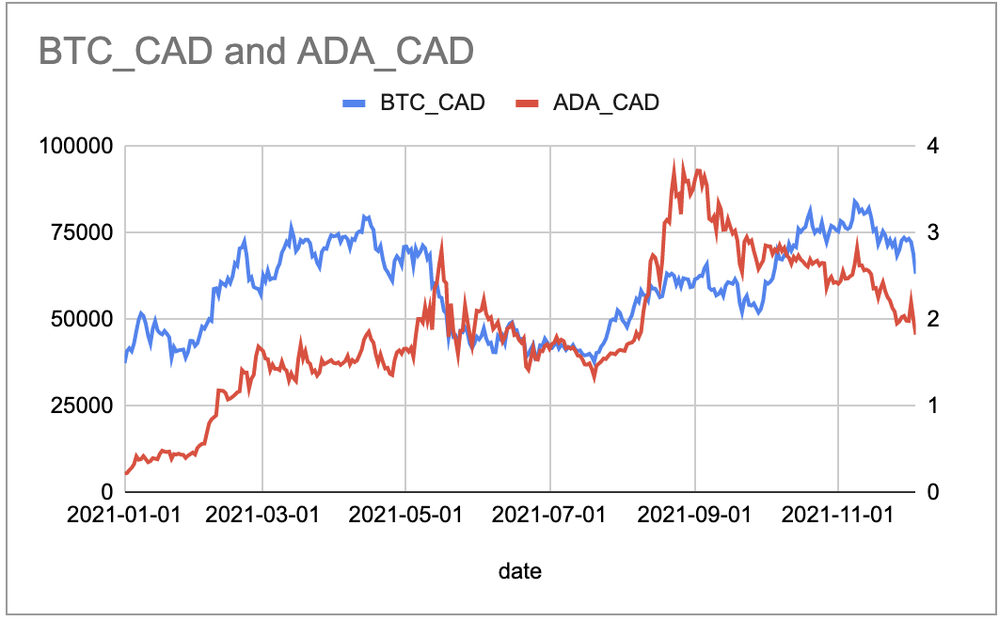

```{r setup, include=FALSE}
knitr::opts_chunk$set(echo = FALSE,
                      message=FALSE,
                      warning=FALSE,
                      fig.height=6,
                      fig.width=9)
options(scipen = 99)
options(digits=3)

library(knitr) ## for functions like include_graphics
library(gtrendsR)
library(tidyverse)
library(lubridate)
library(scales)
library(gridExtra)
library(here)
library(quantmod)
library(PerformanceAnalytics)
library(kableExtra)

theme_set(theme_minimal())
```

## The Temptation of Dual-Axis Charts

Two common scenarios:

1. Comparing trends in two (or more) similar data sets that have vastly different scales.
2. Comparing a volume metric with a related rate or ratio metric.

(for 1 we can use crypto prices: bitcoin vs cardano; for 2 we can use google analytics sessions vs pages/session or bounce rate or goal conversion rate)

```{r}
## import crypto data
crypto_data <- read_csv(here('input','btc-ada-price.csv'))
```

[ggplot2 dual-y-axis reference](https://www.r-graph-gallery.com/line-chart-dual-Y-axis-ggplot2.html)

### Scenario 1: Compare trends in similar metrics from two datasets

Suppose we are interested in crypto currencies and are curious about how a crypto currency like Cardano, with its token ADA compares against Bitcoin (BTC). Our first thought my be to compare prices over a recent period, to answer questions like:

* What are the relative changes in the currencies over time?
* Do the two follow a similar pattern of ups and downs?
* Are there any points where a general pattern breaks? (could provide focus for further investigation)

As always, the visualization choice should be based on **what questions we are trying to answer** and **what we are hoping to learn**. 

So we gather some price data (Cdn$). Here is a random sample of rows, along with summary data. We can see the two sets of prices are on much different scales!

```{r}
## get random sample of row numbers
smpl <- sample(1:nrow(crypto_data), 6, replace = FALSE)
## generate table of random rows, by date; 'float_left' allows tables to be side-by-side
crypto_data[smpl,] %>% arrange(date) %>% kable %>% kable_styling(full_width = FALSE, position='float_left')
## show summary of data
summary(crypto_data) %>% kable %>% kable_styling(full_width = FALSE, position='left')
```

#### Basic line chart

This is confirmed in a basic line chart produced in ggplot2:

```{r, echo=TRUE, fig.height=4, fig.width=5}
crypto_data %>% ggplot(aes(x=date))+geom_line(aes(y=BTC_CAD), color='gold')+
  geom_line(aes(y=ADA_CAD), color='blue')
```

#### Dual-axis option

A common approach, then, is to use dual y-axis, with different scales on each, to enable visibility of the data side by side. This can be a trap if not managed carefully, though. There are two key questions to ask:

**1. what should the range of the second axis be?**
2. How to make it as easy as possible for user to interpret, without having to wrap their heads around lining up different data with different axes.

Depending on your tool of choice, you may have a variety of options. For example, default two-axis chart in Google Sheets looks like this:

```{r, fig.height=4, fig.width=5}

## for actual blog posting, need to put images in 'figure' folder and reference there
# include_graphics(here('figure','<image>'))
```

Which, for this data, looks to be not bad. It shows a relatively close relationship in trends and some points, divergence at others. Maybe cardano is more volatile, prone to relatively higher peaks and lower troughs?

#### Relative Scales Matter

The above Google sheets chart is based on an automatically-selected ratio of 25000:1 in the two axes. This automatic selection may be suitable in some cases, but not necessarily all. 

In R, ggplot2 includes the option to add a secondary y-axis and set the transformation from the left axis to the right axis. This provides flexibility, but also comes with a caution:

* **the choice of relative scales can spin the interpretation of the data in different ways**, as shown in the examples below: (based on 4 charts built with the code shown below but different transformation values)

```{r, echo=TRUE, fig.height=3, fig.width=4}
## select a relevant transfminator
transfm <- 5000
#transfm
col_left <- 'darkgoldenrod3'
col_right <- 'blue'

ch_title <- paste0('BTC vs ADA (scale ratio: ', transfm,')')
cd1 <- crypto_data %>% ggplot(aes(x=date)) +
  geom_line(aes(y=BTC_CAD), color=col_left)+
  geom_line(aes(y=ADA_CAD*transfm), color=col_right)+
  # Custom the Y scales:
  scale_y_continuous(
    # Features of the first axis
    name = "BTC",
    # Add a second axis and specify its features
    sec.axis = sec_axis(~./transfm, name="ADA")
  )+labs(title=ch_title, x="")
```

```{r, fig.height=3, fig.width=4}
## select a relevant transfminator
transfm2 <- 10000
#transfm
#col_left <- 'gold'
#col_right <- 'blue'

ch_title <- paste0('BTC vs ADA (scale ratio: ', transfm2,')')

cd2 <- crypto_data %>% ggplot(aes(x=date)) +
  geom_line(aes(y=BTC_CAD), color=col_left)+
  geom_line(aes(y=ADA_CAD*transfm2), color=col_right)+
  # Custom the Y scales:
  scale_y_continuous(
    # Features of the first axis
    name = "BTC",
    # Add a second axis and specify its features
    sec.axis = sec_axis(~./transfm2, name="ADA")
  )+labs(title=ch_title, x="")
```

```{r, fig.height=3, fig.width=4}
## select a relevant transfminator
transfm3 <- 25000
#transfm
#col_left <- 'gold'
#col_right <- 'blue'

ch_title <- paste0('BTC vs ADA (scale ratio: ', transfm3,')')

cd3 <- crypto_data %>% ggplot(aes(x=date)) +
  geom_line(aes(y=BTC_CAD), color=col_left)+
  geom_line(aes(y=ADA_CAD*transfm3), color=col_right)+
  # Custom the Y scales:
  scale_y_continuous(
    # Features of the first axis
    name = "BTC",
    # Add a second axis and specify its features
    sec.axis = sec_axis(~./transfm3, name="ADA")
  )+labs(title=ch_title, x="")
```

```{r, fig.height=3, fig.width=4}
transfm4 <- 50000
#transfm
#col_left <- 'gold'
#col_right <- 'blue'

ch_title <- paste0('BTC vs ADA (scale ratio: ', transfm4,')')
cd4 <- crypto_data %>% ggplot(aes(x=date)) +
  geom_line(aes(y=BTC_CAD), color=col_left)+
  geom_line(aes(y=ADA_CAD*transfm4), color=col_right)+
  # Custom the Y scales:
  scale_y_continuous(
    # Features of the first axis
    name = "BTC",
    # Add a second axis and specify its features
    sec.axis = sec_axis(~./transfm4, name="ADA")
  )+labs(title=ch_title, x="")
```

```{r, echo=TRUE}
grid.arrange(cd1, cd2, cd3, cd4, nrow=2)
```

*Right from the start, there is an obvious flaw to these charts: unless you are familiar with the data, it is not clear which line belongs to which crypto. This was handled with a legend in the Google sheets chart. It can also be handled by matching colors (example of this below). For now, just noting that as a known flaw - and something to watch out for.*

In terms of relative scales, the smaller the ratio used, the more the secondary axis is stretched out. The result:

* **top-left**: the lowest ratio used (5000:1) compresses the ADA (blue) line, revealing some patterns but suggesting it is relatively stable compared to BTC (gold) line.
* cycling through a few variations shows the impact of various relative scales.
* **lower-left**: 25000:1 ratio as the Google sheets example.
* **lower-right**: by the time we get here, we have flipped the story to where ADA (blue) looks like the volatile one, soaring to great heights and then crashing back down, while BTC (gold) is relatively quiet.

I'm not sure there is a clear/correct/easy answer here. I think it is just a hazard that comes with these charts, something to watch out for when data is presented this way, and a reason to be wary of using dual-axis charts.

As far as finding a fair/reasonable transformation value, one way to go about it may be to calculate an overall ratio of the two datasets. For example, rather than picking a number:

```{r, echo=TRUE}
transfm <- median(crypto_data$BTC_CAD)/median(crypto_data$ADA_CAD)
#transfm
```

Median BTC vs ADA is `r transfm` so this could be useful for transformation, at least as starting point. You could 1) use this directly, as below, or 2) use it to guide you toward a nearby number that is a nice, round number to work with. For example, a reasonably close multiple in this case is **10,000** (chart in the top-right of the 4 charts above). This is much easier for a person to relate to when comparing the two axes, making it slightly less daunting. 

```{r, fig.height=4, fig.width=5}
ch_title <- paste0('BTC vs ADA (scale ratio: ', transfm,')')
crypto_data %>% ggplot(aes(x=date)) +
  geom_line(aes(y=BTC_CAD), color=col_left)+
  geom_line(aes(y=ADA_CAD*transfm), color=col_right)+
  # Custom the Y scales:
  scale_y_continuous(
    # Features of the first axis
    name = "BTC",
    # Add a second axis and specify its features
    sec.axis = sec_axis(~./transfm, name="ADA")
  )+labs(title=ch_title, x="")
```

### Scenario 2: Comparing a Count and a Ratio

In other cases, we may want to compare patterns in a volume or count metric with a related key indicator. Here's an example using some Google Analytics data for a website:

* daily users
* daily conversion rate

Interesting questions with these metrics can inlude:

* what is the relationship between patterns in site traffic and conversion rates?
* do increases in daily users correspond to decreases in conversion rates or vice versa?
* are there any points where breaking of the typical relationship between these metrics warrants further investigation?

Quick look at the data:

```{r}
## import data
ga4 <- read_csv(here('input','GA4-export.csv'))
#ga_data <- ga4 %>% select(date, users, conv_rate)
ga_data <- ga4 %>% select(date, users, conv_rate) %>% 
  mutate(
    date=mdy(date),
    conv_rate=str_remove(conv_rate, "%"),
    conv_rate=as.numeric(conv_rate)/10
  )

## get random sample of row numbers
smpl <- sample(1:nrow(ga_data), 6, replace = FALSE)
## generate table of random rows, by date; 'float_left' allows tables to be side-by-side
ga_data[smpl,] %>% arrange(date) %>% kable %>% kable_styling(full_width = FALSE, position='float_left')
## show summary of data
summary(ga_data) %>% kable %>% kable_styling(full_width = FALSE, position='left')
```


```{r, echo=TRUE, fig.height=4, fig.width=5}
transfm <- median(ga_data$users)/median(ga_data$conv_rate)

col_left <- 'blue'
col_right <- 'purple'

ch_title <- "Website users vs conversation rates"
ch_sub <- paste0("(Ratio: ",transfm,")")
ga_data %>% ggplot(aes(x=date)) +
  geom_line(aes(y=users), color=col_left)+
  geom_line(aes(y=conv_rate*transfm), color=col_right)+
  # Custom the Y scales:
  scale_y_continuous(
    # Features of the first axis
    name = "users", labels=comma,
    # Add a second axis and specify its features
    sec.axis = sec_axis(~./transfm, name="conversion %", labels=percent)
  )+labs(title=ch_title, subtitle=ch_sub, x="")+
  theme(axis.text.y.left = element_text(color=col_left, size=8),
        axis.title.y.left = element_text(color=col_left, size=12),
        axis.text.y.right = element_text(color=col_right, size=8),
        axis.title.y.right = element_text(color=col_right, size=12))
```

Looks pretty messy but there does seem to be some degree of opposite movement in these two metrics. There is also the precipitous drop in conversion rate at the start of the period that is probably worth looking into, especially since there is little change in volume of users at that point.

When working with two different types of metrics, a variation on the line charts that can help to bring out the message within the data is to combine bar chart and line chart.

* bar chart to represent count or volume metrics
* line chart for ratio or rate metrics

In the example below, I have changed the transformation ratio from the **median calculation (~26 million)** to **10 million**. This *maybe* provides a more intuitive way to interpret the relationship: it is easy to see that when the scale doubles on one side, the other scale doubles as well.  

```{r, echo=TRUE, fig.height=4, fig.width=5}
transfm <- median(ga_data$users)/median(ga_data$conv_rate)
transfm <- 10000000
#transfm
col_left <- 'lightblue'
col_left_t <- 'blue'
col_right <- 'darkblue'

ch_title <- "Website users vs conversation rates"
ga_data %>% ggplot(aes(x=date)) +
  ## change line to bar chart for contrast
  geom_col(aes(y=users), fill=col_left)+
  geom_line(aes(y=conv_rate*transfm), color=col_right, size=1)+
  # Custom the Y scales:
  scale_y_continuous(
    # Features of the first axis
    name = "users", labels=comma,
    # Add a second axis and specify its features
    sec.axis = sec_axis(~./transfm, name="conversion %", labels=percent)
  )+labs(title=ch_title, x="")+
  theme(axis.text.y.left = element_text(color=col_left_t, size=8),
        axis.title.y.left = element_text(color=col_left_t, size=12),
        axis.text.y.right = element_text(color=col_right, size=8),
        axis.title.y.right = element_text(color=col_right, size=12))

```

It does seem easier to untangle the relationship using the bar and line combination, along with the even 10M:1 ratio.

### Alternatives to Dual-Axis

* separate -> either side-by-side or above/below; especially if the focus is more on one than the other
* normalize each dataset (center on zero)
* use along with other statistical measures

tips:

* make sure carefully labelled
* in some cases, label lines directly
* consider mixing bars (vol) and lines (ratios)
* be responsible - don't contort to fit your pre-defined message or beliefs or hopes
* make second axis a factor of 10 ratio
* use bars with lines on ratio charts
* combine with other statistics:
  + correlation
  + standard deviation (how to deal with non-normal? )